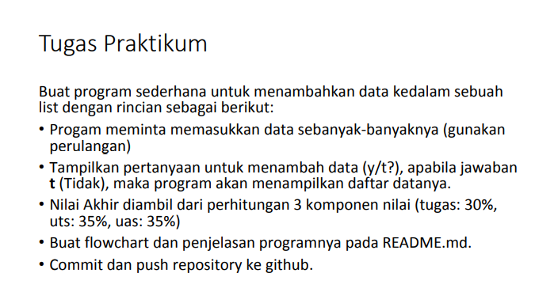
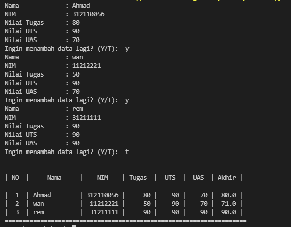

# List Python
klik disini untuk melihat [Tugas Latihan](https://github.com/AhmadSon/Lab4.git)
## Tugas Pratikum
- Soal<p>

## Program
```bash
#program table data dengan perulangan
nama_list = []
nim_list = []
tugas_list = []
uts_list = []
uas_list = []
rata = []

a = 0
while True:
    nama_list.append(str(input("Nama\t\t : ")))
    nim_list.append(int(input("NIM\t\t : ")))
    tugas = int(input("Nilai Tugas\t : "))
    uts = int(input("Nilai UTS\t : "))
    uas = int(input("Nilai UAS\t : "))
    tugas_list.append(tugas)
    uts_list.append(uts)
    uas_list.append(uas)
    rata.append(tugas * .3 + uts * .35 + uas * .35)
    menambah = input("Ingin menambah data lagi? (Y/T):  ")
    if menambah =="t" or menambah =="T" :
        break
print()
print (68*"=")
print("| {0:^3} | {1:^12} | {2:^9} | {3:^6} | {4:^5} | {5:^5} | {6:^5} |".format("NO", "Nama", "NIM", "Tugas", "UTS", "UAS", "Akhir"))
print (68*"=")
no = 0
for nama, nim, tugas, uts, uas, akhir in zip (nama_list, nim_list, tugas_list, uts_list, uas_list, rata):
    no += 1
    print("| {0:^3} | {1:<12} | {2:>9} | {3:>6} | {4:>5} | {5:>5} | {6:>5} |".format(no, nama, nim, tugas, uts, uas, akhir))
print (68*"=")
```
- <b>Hasil Program</b><p>
<p>
- <b>Penjelasan tentang program</b><p>
Program di atas adalah program list penginputan data dengan Looping/perulangan<p>
untuk perulangan nya sendiri saya juga menggunakan zip, karena saya butuh lebih dari satu iterable maka saya menambahkan zip di program ini<p>
Fungsi zip() mengembalikan nilai sesuai dengan argumen yang diberikan.<P>