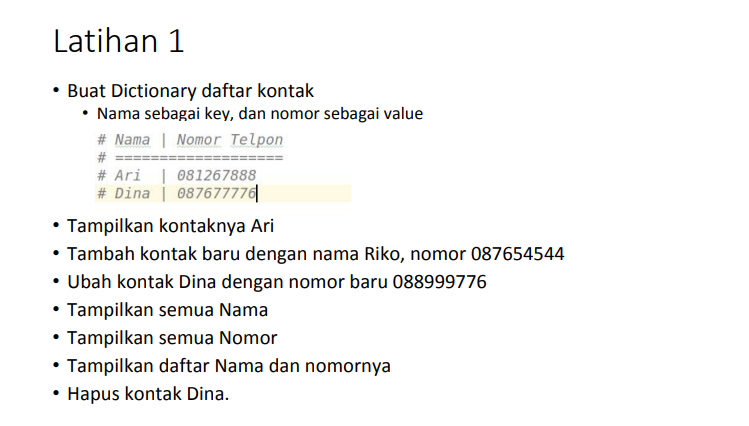

<body>
    <table border="1">
        <tr>
            <th> Nama</th>
            <th>NIM</th>
            <th>Kelas</th>
        </tr>
        <tr>
            <td>Ahmad Syukron</td>
            <td>312110056</td>
            <td>TI.21.A.1</td>
        </tr>
    </table>
</body>

# Dictonary Python

## Tugas Latihan
- <b>Soal</b><p>
<p>

- <b>Codiingan</b><p>
```bash
# Latihan 1

a = {'Ari':'081267888', 'Dina':'087654588'}  # Nama sebagai key, dan nomor sebagai value
print ("Buat Dictionary daftar kontak")
print ("Nama | Nomor Telpon")

print ("Menampilkan dictonary kontak")
print (a)
print (50*"-")

print ("Tampilkan kontak Ari")
print (a['Ari']) #Tampilkan kontak Ari
print (50*"-")

print ("Menambah kontak baru dengan nama Riko, nomor 087654544")
a.update({'Riko':'087654544'}) #Menambah kontak baru dengan nama Riko, nomor 087654544
print (a)
print (50*"-")

print ("mengubah kontak Dina dengan nomor baru 088999776")
a['Dina'] = '088999776' # mengubah kontak Dina dengan nomor baru 088999776
print (a)
print (50*"-")

print ("Tampilkan semua nama")
print(a.keys()) #Tampilkan semua nama
print (50*"-")

print ("Tampilkan semua nomor")
print(a.values()) #Tampilkan semua nomor
print (50*"-")

print ("Tampilkan daftar Nama dan nomornya")
print (a.items()) #Tampilkan daftar Nama dan nomornya
print (50*"-")

print ("Menghapus kontak Dina")
del a['Dina'] #Menghapus kontak Dina
print(a)
```
- <b>Tampilan Hasil Program</b><p>
<p>


## Tugas Pratikum
- <b>Soal</b><p>
<p>

- <b>Codingan</b><p>